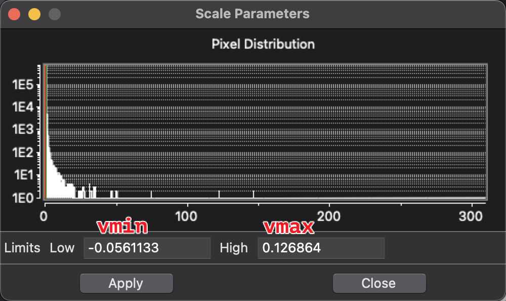
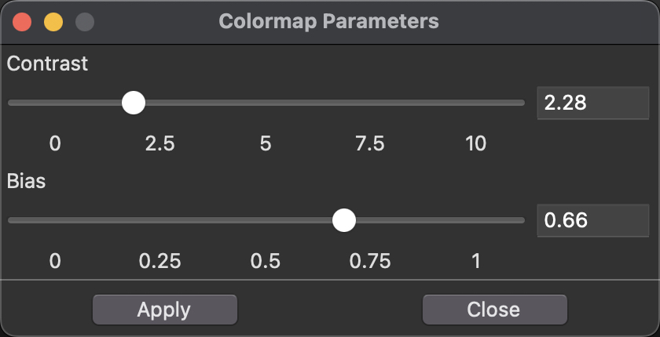
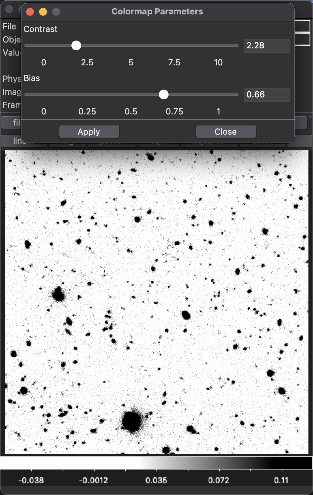
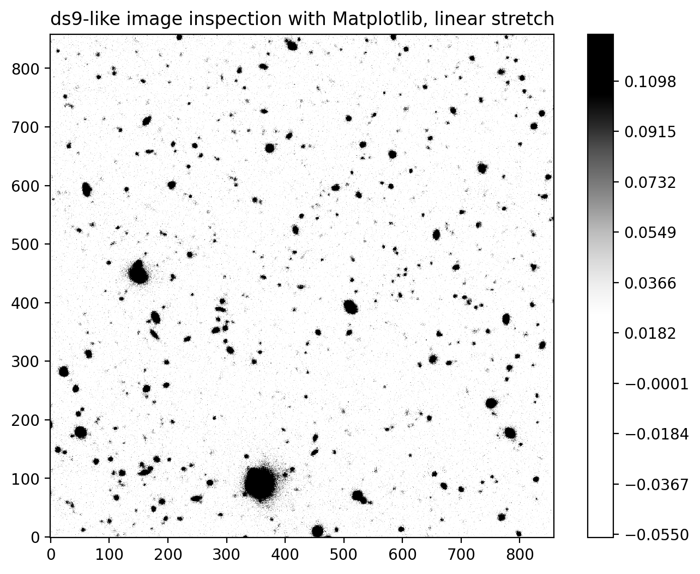
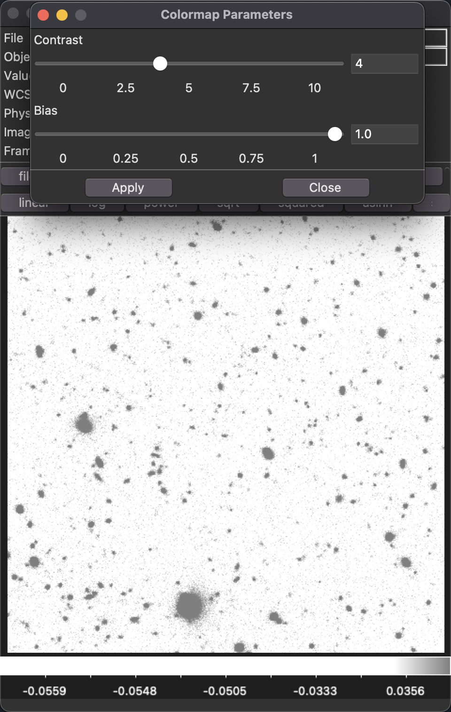
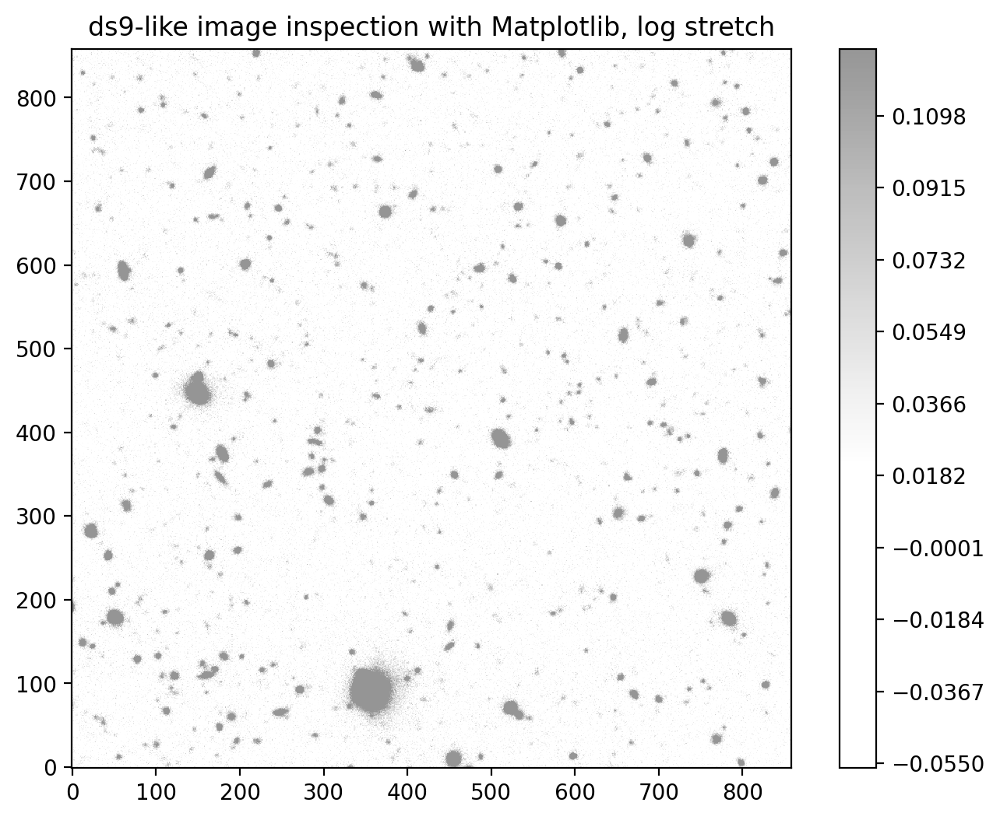

# Reproducing SAOImageDS9 Colormap in Python

**Check code in [nbviewer](https://nbviewer.org/github/lmytime/Reproduce_DS9_colormap_in_Python/blob/main/norm_ds9.ipynb).**

## Abstract
[SAOImageDS9](https://sites.google.com/cfa.harvard.edu/saoimageds9) is an image display and visualization tool for astronomical data, which can be used for fast image processing and inspection. In DS9, we can drag the mouse on the image viewer to manipulate the colormap and then visualize data effectively and quickly. Unlike the DS9, color normalization and stretch in Python should be set manually.

Here we take notes about how to reproduce the colormap of DS9 in Python, supposing that you have already tuned the colormap parameters in DS9.

## Image display in DS9
How does an image look like in DS9? Or what values of pixels should be what colors? It is mostly related to color mapping, stretch, scale parameters, and color parameters.

### Color mapping (Colormap).
The colormap is a function that maps the values of the source image to the colors of the target image. Without loss of generality, the color is defined in the domain of [0, 1].
$$
Cm: x  \in [0, 1] \rightarrow Cm(x) \in \text{color space, e.g., RGB or RGBA},
$$

For an original image, the pixel values should be handled by normalization and stretch first to [0, 1].

### Normalization.
Normalization is to map the original image to [0, 1]. It is denfined as
$$
y = \frac{x - v_\mathrm{min}}{v_\mathrm{max} - v_\mathrm{min}},
$$
where x represents the values in the original image and $v_\mathrm{min}$ and $v_\mathrm{max}$ are the value cuts, which is named scale parameters in DS9.


### Scale Parameters
($v_\mathrm{min}$ and $v_\mathrm{max}$). Scale parameters can be determined by many methods, including zscale, minmax, and manual setting.



### Stretch.
Stretch means scaling the image. Without loss of generality, stretch $S(x)$ is defined as a transformation from normalized source image with domain [0, 1] to [0, 1]. The function can be linear, log, and more.
$$
S: y  \in [0, 1] \rightarrow S(y) \in [0, 1].
$$

Linear stretch is
$$S_{linear}(y) = y.$$

Log stretch is
$$S_{log}(y)  = \frac{\log(ay+1)}{\log(a+1)},$$
where a is stretch parameter, with default $a=1000$ in DS9.

There are some other stretchs, e.g., sinh, asinh, power, histogram.


(3) Color Parameters (contrast and bias). Color parameters are used to adjust the colormap in DS9. When you drag the mouse in the display window of DS9, the actual modified parameters are the contrast and bias. Contrast is adjusted by dragging the right mouse button vertically in the display window. Bias is adjusted by dragging the right mouse button horizontally in the display window.

Contrast refers to the rate of change of color with color level. At low contrast, color changes gradually over many intensity levels, while at high contrast it can change rapidly within a few levels. Contrast adjustment works whether the image is in black and white, or in color.

Bias refers to any offset added to the color levels before the color map is applied. In other words, it determines where the color changes start. Changing the bias corresponds to translating the color map with respect to the intensity levels without changing the overall "look" of the map. At low bias, low intensities (i.e., low pixel values) will have non-zero color differences, while at high bias only high pixel values will have non-zero differences.




The effect of contrast and bias can be equal to an additional ContrastBias stretch to images which have been normalized and stretched. ContrastBias stretch is defined as
$$
S_{CB}(x) = (x−\text{bias}) \times \text{contrast}+0.5,
$$
and the output values are clipped to the [0, 1] range.

### Summary
The image display in DS9 can be described as a function chain. For a pixel value $x$, first normalize
$$
y = \frac{x - v_\mathrm{min}}{v_\mathrm{max} - v_\mathrm{min}},
$$
then stretch
$$
s = S(y),
$$
next apply ContrastBias stretch
$$
Sc = (s−\text{bias}) \times \text{contrast}+0.5,
$$
where the output values are clipped to the [0, 1] range. Final get the color according to the colormap
$$
Color = Cm(Sc).
$$


## Reproducing in Python
Assuming we have tuned well the vmin, vmax, bias, and contrast in DS9, we can reproduce the same colormap in python.

```python
def norm_ds9(vmin, vmax, bias=0.5, contrast=1, stretch='linear', stretch_param=None):
    """
    This function can be used to generate a Matplotlib Normalization
    to reproduce ds9 image inspection by dragging mouse.

    Input:
    vmin, vmax, bias, contrast, stretch.
    vmin, vmax: shown in Scale Parameters in ds9
    bias, contrast: shown in Colormap Parameters in ds9; bias is in [0, 1], contrast is in [0, +inf];
    bias=0.5, contrast=1 is the default setting.
    stretch: 'linear' or 'log';
    'linear' is the default setting.
    stretch_param: only used for 'power', 'asinh', and 'log' stretch.

    Return a Normalization class to be used with Matplotlib.
    """
    import astropy.visualization as astrovi

    if stretch == 'linear':
        stretch = astrovi.LinearStretch()
    elif stretch == 'sqrt':
        stretch = astrovi.SqrtStretch()
    elif stretch == 'power':
        if(stretch_param is None):
            raise ValueError("stretch_param must be provided for power stretch.")
        stretch = astrovi.PowerStretch(stretch_param)
    elif stretch == 'log':
        if(stretch_param is None):
            stretch_param = 1000
        stretch = astrovi.LogStretch(stretch_param)
    elif stretch == 'asinh':
        if(stretch_param is None):
            stretch_param = 0.1
        stretch = astrovi.AsinhStretch(stretch_param)
    else:
        raise ValueError(f'Unknown stretch: {stretch}.')

    # Apply additional bias and contrast stretch
    stretch =  astrovi.CompositeStretch(stretch, astrovi.ContrastBiasStretch(contrast, bias))

    norm = astrovi.ImageNormalize(stretch=stretch, vmin=vmin, vmax=vmax, clip=True)

    return norm
```

Here we show two examples.

### Example 1
$v_\mathrm{min}, v_\mathrm{max} = -0.0561133, 0.126864$

$\mathrm{bias}, \mathrm{contrast} = 0.66, 2.28$

Use linear strecth.

Image in DS9 looks like:



Image reproduced in python look like:




### Example 2
$v_\mathrm{min}, v_\mathrm{max} = -0.0561133, 0.126864$

$\mathrm{bias}, \mathrm{contrast} = 1.0, 4.0$

Use log strecth.

Image in DS9 looks like:



Image reproduced in python look like:



We almost reproduce the same visual effect! Please check the code in `norm_ds9.ipynb`.